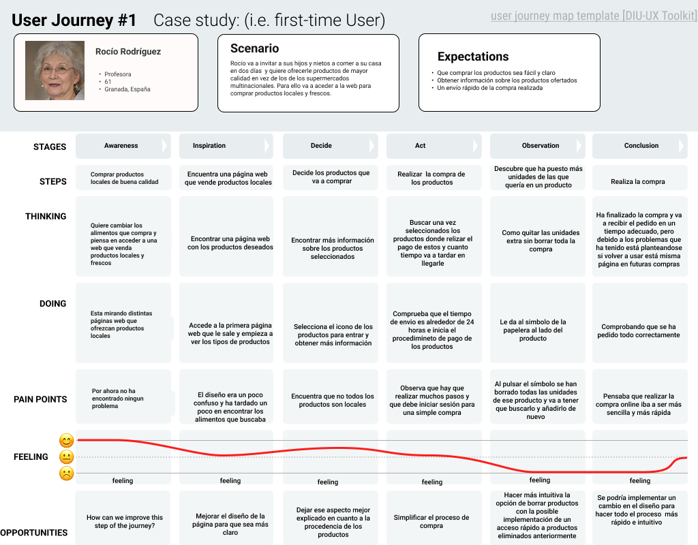

## DIU - Practica1, entregables

- USER RESEARCH PLAN ->  
- Desk research: Análisis Competencia
  
  - Justificación de la elegida ->  
- 2 Personas
  primera persona
  
  - Justificación de la persona de Rocío Rodríguez -> 

  segunda persona
  
- 2 User Journey Map  ( 1 por persona)
  
  - Justificación del User Journey Map de Rocío Rodríguez -> 
- Revisión de Usabilidad 

>>>> Este fichero se debe editar para que cada evidencia quede enlazada con el recurso subido a la carpeta de la practica. Se pide más detalle técnico en las descripciones de lo que sería el README principal del repositorio y que corresponde a la descripcion del Case Study.
>>>> Incluya aquí simpre una valoración final del equipo sobre la propia realización de la práctica
