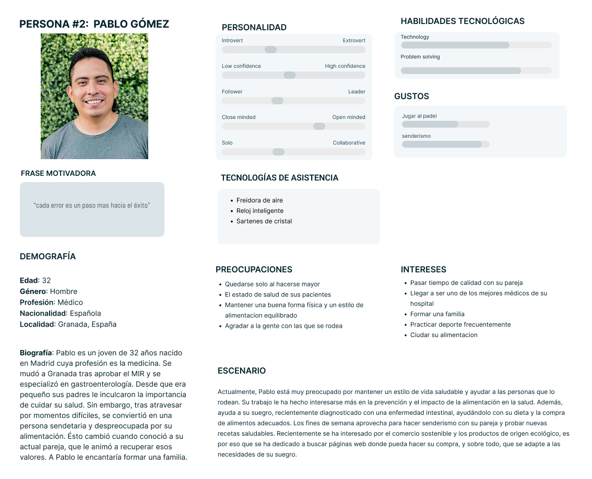
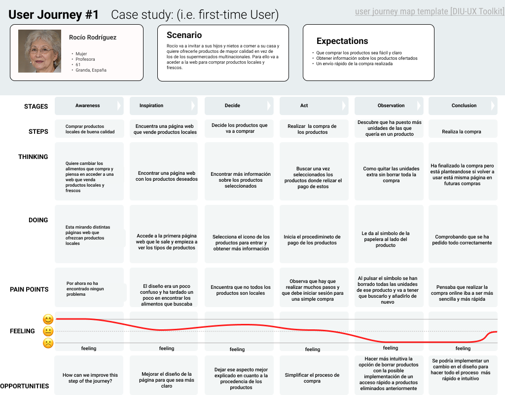

# DIU - Practica1, entregables

Grupo: DIU1.JaviManuel Curso: 2024/25

Miembros:
 * :bust_in_silhouette:  Javier Ruiz Mondragón    :octocat:     
 * :bust_in_silhouette:  Manuel Jesús Junquera Lobón    :octocat:
 
 
## 1. USER RESEARCH PLAN 

Este proyecto consiste en la realización del análisis de una página web que ofrece servicios en base al ocio y comercio sostenible, concretamente especializada en mercados ecológicos. El principal propósito de este estudio es mejorar la experiencia de los usuarios con la web, así como de mejorar varios aspectos de esta cómo pueden ser conseguir nuevos clientes, además de proveedores con nuevos productos.

Para la realización de esté análisis se van a establecer una serie de objetivos que se pretenden cumplir, entre ellos encontramos objetivos de distintos tipos como pueden ser comerciales, económicos, personales y otros distintos. Algunos ejemplos de este tipo de objetivos pueden ser mejorar los beneficios y el número de usuarios, garantizar la seguridad y la protecciónd de datos y un crecimiento profesional junto con la mejora de aptitudes como el pensamineto crítico y la capacidad de resolución de problemas.

En adición, también se va a establecer que tipo de información se desea recolectar además de los distintos métodos de investigación que se van a emplear. Por no hablar de la importancia de realizar un estudio de los posibles partcipantes/usuarios así como del estudio de la competencia.

Por último, en cuanto a nuestra experiencia en este campo cabe recalcar que como interesados y observadores tenemos bastante experienca ya que nosotros mismos y gente de nuestro alrededor realiza diariamente compras de productos a través de internet. Por otra parte, como diseñadores es cierto que no contamos con mucha experinecia con este tipo de aplicaciones.

Para más detalle pulsar este enlace -> 
 
 

## 2. PERSONAS

- USER RESEARCH PLAN ->  
- Desk research: Análisis Competencia
  
  - Justificación de la elegida ->  
- 2 Personas
  primera persona
  
  - Justificación de la persona de Rocío Rodríguez -> 

  segunda persona
  
- 2 User Journey Map  ( 1 por persona)
  
  - Justificación del User Journey Map de Rocío Rodríguez -> 
- Revisión de Usabilidad 

>>>> Este fichero se debe editar para que cada evidencia quede enlazada con el recurso subido a la carpeta de la practica. Se pide más detalle técnico en las descripciones de lo que sería el README principal del repositorio y que corresponde a la descripcion del Case Study.
>>>> Incluya aquí simpre una valoración final del equipo sobre la propia realización de la práctica
