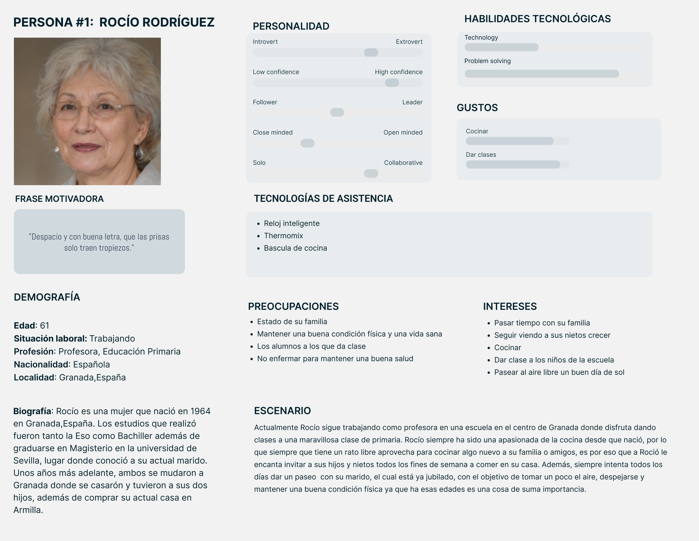

# DIU - Practica1, entregables

Grupo: DIU1.JaviManuel Curso: 2024/25

Miembros:
 * :bust_in_silhouette:  Javier Ruiz Mondragón    :octocat:     
 * :bust_in_silhouette:  Manuel Jesús Junquera Lobón    :octocat:
 
 
## 1. USER RESEARCH PLAN 

Este proyecto consiste en la realización del análisis de una página web que ofrece servicios en base al ocio y comercio sostenible, concretamente especializada en mercados ecológicos. El principal propósito de este estudio es mejorar la experiencia de los usuarios con la web, así como de mejorar varios aspectos de esta cómo pueden ser conseguir nuevos clientes, además de proveedores con nuevos productos.

Para la realización de esté análisis se van a establecer una serie de objetivos que se pretenden cumplir, entre ellos encontramos objetivos de distintos tipos como pueden ser comerciales, económicos, personales y otros distintos. Algunos ejemplos de este tipo de objetivos pueden ser mejorar los beneficios y el número de usuarios, garantizar la seguridad y la protecciónd de datos y un crecimiento profesional junto con la mejora de aptitudes como el pensamineto crítico y la capacidad de resolución de problemas.

En adición, también se va a establecer que tipo de información se desea recolectar además de los distintos métodos de investigación que se van a emplear. Por no hablar de la importancia de realizar un estudio de los posibles participantes/usuarios así como del estudio de la competencia.

Por último, en cuanto a nuestra experiencia en este campo cabe recalcar que como interesados y observadores tenemos bastante experienca ya que nosotros mismos y gente de nuestro alrededor realiza diariamente compras de productos a través de internet. Por otra parte, como diseñadores es cierto que no contamos con mucha experinecia con este tipo de aplicaciones.

Para más detalle pulsar este enlace -> 
 

## 2. PERSONAS

---
Hemos escogido a Rocío como persona ya que nos gustaría tener el perfil de una persona de edad avanzada que no termina de estar familiarizada del todo con las tecnologías. De esta forma, podemos ver la página desde otra perspectiva que nos permite ver distintos puntos a mejorar para que la experiencia de todo el mundo sea la óptima. Por último, su pasión por la cocina la hace una clienta ideal, al ser uno de los principales servicios de la página la venta de alimentos ecológicos y frescos.

 

---
"Poner justificación de porque se ha elegido a Pablo como persona"

 

## 3. EXPERIENCE JOURNEY MAP

---
Rocío se ha visto en la necesidad de adentrarse en internet para encontrar productos locales de gran calidad, en consecuencia, se ha encontrado con la página web Valle&Vega.
Sin embargo, la experiencia ha sido distinta a la que se imaginaba ya que le ha costado un poco encontrar los productos que buscaba además de tener problemas con el proceso de compra, aunque al final haya conseguido su objetivo en el tiempo que buscaba. Este caso es un poco especial ya que aunque Rocío se haya quedado con un mal sabor de boca,planteándose si volver a usar la web, hay que tener en cuenta la edad de Rocío y que no está muy familiarizada con la tecnología, aun así, nos aporta una visión distinta que nos puede ayudar a la hora de encontrar ideas para mejorar la página y la experiencia de los usuarios.

 

[Foto del journey map de Pablo]
---
"Poner justificación del journey map de Pablo"

 

## 4. COMPETITIVE ANALYSIS

---
Para comenzar, de entre los casos propuestos nos hemos decantado por Valle&Vega (https://valleyvega.org/) , la cual es una asociación para la producción y comercialización kilómetro 0 de alimentación ecológica en la provincia de Granada. La razón por la que hemos elegido está es debido a que nos ha llamado más la atención, además de parecernos buenísima idea para dar a conocer comercios locales o incluso ganaderos y  agricultores de nuestra propia provincia, sirviendo como impulso para la economía y en consecuencia su crecimiento y expansión.

A continuación, para hacer el competitive analysis hemos elegido las siguientes páginas, Bioencasa (https://bioencasa.es/) y EcoJaral (https://ecojaral.com/) . Ambas son páginas que ofrecen una amplia variedad de productos ecológicos de la provincia de Granada. El motivo de esta elección es que ambas comparten muchas similitudes, al proporcionar productos que provienen de nuestra propia provincia al igual que Valle&Vega.

Haciendo un breve resumen,en Bioenacasa podemos observar que aunque ofrece casi la misma variedad de productos que Valle&Vega, está pagina ofrece un diseño más llamativo y claro, haciéndola más intuitiva además de ofrecer otros servicios no presentes en Valle&Vega como pueden ser repartos a domicilio. Por otra parte Ecojaral tmabién presenta una página más clara e intuitiva que en Valle&Vega, por no hablar de que implementa una buena mecánica para mejorar la experiencia de los usuarios como son los puntos de fidelidad.

Finalmente, podemos observar como las páginas presentan unas puntuaciones similares, haciendo que ninguna destaque sobre las demás. Sin embargo , aunque las páginas nos han parecido interesantes y nos han permitido ver muchos aspectos a mejorar, nos vamos a decantar por Bioencasa, ya que está es la más completa y la que nos va a ayudar más a la hora de implementar mejoras.

>>>> Este fichero se debe editar para que cada evidencia quede enlazada con el recurso subido a la carpeta de la practica. Se pide más detalle técnico en las descripciones de lo que sería el README principal del repositorio y que corresponde a la descripcion del Case Study.
>>>> Incluya aquí simpre una valoración final del equipo sobre la propia realización de la práctica
