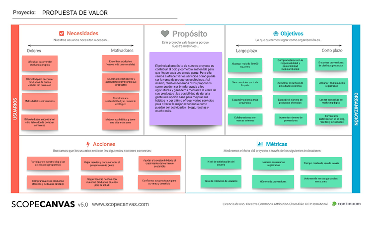

# DIU - Practica2, entregables

Grupo: DIU1.JaviManuel Curso: 2024/25

Miembros:
 * :bust_in_silhouette:  Javier Ruiz Mondragón    :octocat:     
 * :bust_in_silhouette:  Manuel Jesús Junquera Lobón    :octocat:
 

## 1. Ideación
### 1.1 Malla receptora de información

Vamos a realizar una malla receptora de información donde utilizaremos toda la información obtenida de nuestras personas así como aquella
 que tenemos nosotros mismos, es decir, nuestra experiencia y la que hemos obtenido de las distintas páginas analizadas anteriormente. Dicha malla se va a dividir en cuatro apartados principales que hemos considerado los más importantes:
 * Aspectos positivos (Worked) -> son cosas que sabemos que funcionan y que hemos podido observar distintas páginas web.
 * Críticas constructivas (Change) -> son cosas a tener en cuenta para cambiar y mejorar en el futuro.
 * Preguntas de usuario (Questions) -> posibles preguntas que se pueden hacer los usuarios
 * Ideas de mejora (Ideas) -> son las ideas que nos gustaría implementar o al menos tener en cuenta en el futuro desarrollo.

### 1.2 Mapa de empatía

[incluir justificación]

### 1.3 Point of View 

[incluir contenido]

## 2. Propuesta de valor
### 2.1 ScopeCanvas

[incluir justificación]

## 3. Task Analysis
### 3.1 User Task Matrix

[incluir contenido]

### 3.2 User/Task Flow

[incluir contenido]

## 4. Arquitectura de información
### 4.1 Sitemap

[incluir contenido]

### 4.2 Labelling

[incluir contenido]

## 5. Prototipo Lo-FI Wireframe 

[incluir contenido]

## 6. Conclusiones  

[incluye valoración de esta etapa]

