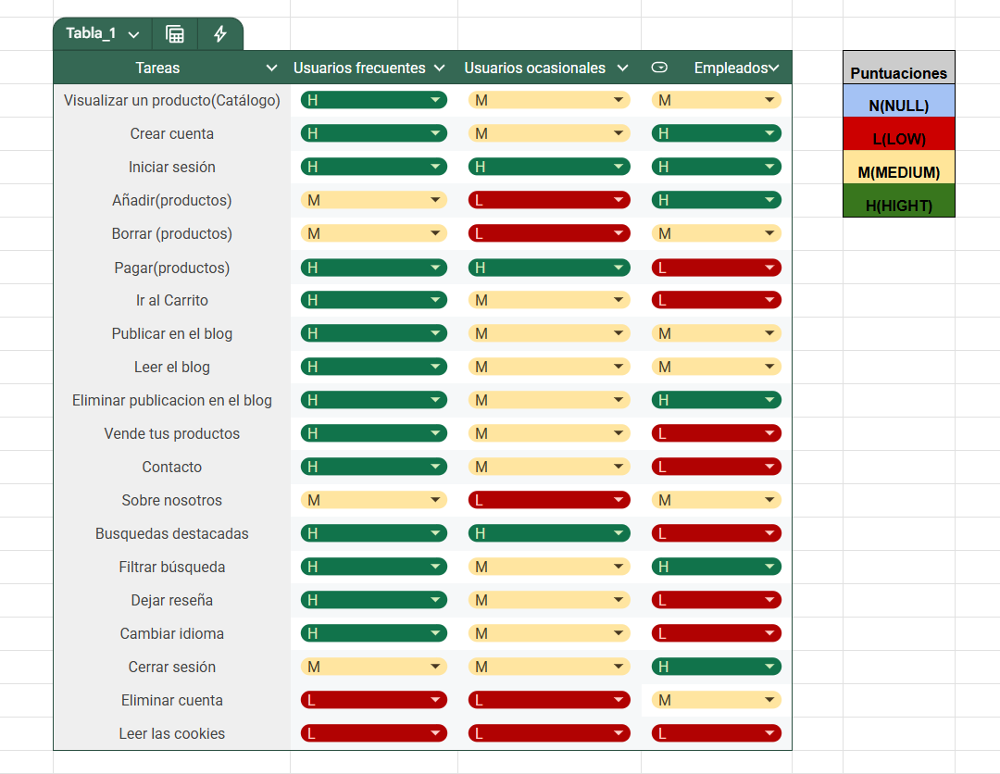
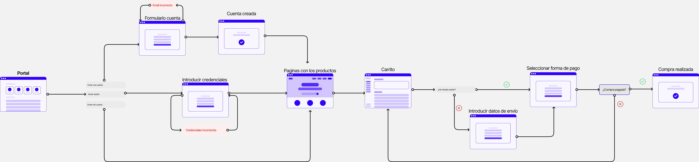

# DIU - Practica2, entregables

Grupo: DIU1.JaviManuel Curso: 2024/25

Miembros:
 * :bust_in_silhouette:  Javier Ruiz Mondragón    :octocat:     
 * :bust_in_silhouette:  Manuel Jesús Junquera Lobón    :octocat:
 

## 1. Ideación
### 1.1 Malla receptora de información

Vamos a realizar una malla receptora de información donde utilizaremos toda la información obtenida de nuestras personas así como aquella
que tenemos nosotros mismos, es decir, nuestra experiencia y la que hemos obtenido de las distintas páginas analizadas anteriormente. 
Dicha malla se va a dividir en cuatro apartados principales que hemos considerado los más importantes:
 * Aspectos positivos (Worked) -> son cosas que sabemos que funcionan y que hemos podido observar de distintas páginas web.
 * Críticas constructivas (Change) -> son cosas a tener en cuenta para cambiar y mejorar en el futuro.
 * Preguntas de usuario (Questions) -> posibles preguntas que se pueden hacer los usuarios
 * Ideas de mejora (Ideas) -> son las ideas que nos gustaría implementar o al menos tener en cuenta en el futuro desarrollo.

### 1.2 Mapa de empatía

Vamos a diseñar un mapa de empatía donde reuniremos tanto el comportamineto de nuestras personas y nuestra experiencia para un futuro diseño. 
El mapa se va a dividir en seis partes principales las cuales son:
* Think & Feel -> recoge todo en cuanto emociones, pensamientos, motivaciones y necesidades.
* Ear -> se basa en todo lo que se ha escuchado de diferentes sitios y personas.
* See -> es todo aquello que se ha visto.
* Say & Do -> se trata de todo lo que se dice y hace.
* Pain -> obstáculos y dificultades que han tenido.
* Gain -> todos los benefios, éxitos y objetivos.

Para entender el mapa es necesario tener en cuenta la siguiente leyenda:
* Color Morado -> representa la persona de Pablo.
* Color Rojo -> representa la persona de Rocío.
* Color Amarillo -> representa nuestra experiencia.

### 1.3 Conclusiones
Antes de comenzar con el diseñó de nuestro proyecto, vamos a realizar un resumen de las cosas más importantes que hemos visto. En la malla receptora de información hemos podido
observar ideas que ya funcionan las cual se van a implemetar y por otro lado tambien se nos han ocurrido algunas nuevas que nos gustaría poner en marcha como el servicio de reparto express o la venta de platos preparados. A continucación, hemos podido obetener del mapa de empatía una idea de lo que piensa y hace la gente, donde caben destacar algunos puntos como las difucultades que tienen algunas personas como la desconfianza hacia un servicio o los malos comentarios, mientras que por otro lado tenemos puntos positivos a nombrar como las variedad de productos y la venta de productos frescos,locales y saludables.

## 2. Primeros pasos de diseño
### 2.1 ScopeCanvas (Propuesta de valor)

Con esta propuesta de valor se pretende explicar en que consiste nuestro proyecto, para ello, se van a tratar distintos puntos a destacar como 
las necesidades de nuestros usuarios, objetivos que queremos lograr como organización tanto a largo como a corto plazo, nuestro propósito general,
acciones que queremos que nuestros usuarios lleven a cabo y métricas que se van a tener en cuenta a la hora de analizar el progreso del proyecto.

[ScopeCanvas](ScopeCanvas.pdf)

## 3. Task Analysis
### 3.1 User Task Matrix

Hemos analizado las tareas más importantes, teniendo en cuenta 3 valores de relevancia(expuestos a la derecha de la tabla), y valorándolos en 3 posibles usuarios de nuestro sitio web. Nos ha parecido interesante diferenciar al usuario ocasional del usuario frecuente. Las tareas están ordenadas por importancia, siendo la de arriba del todo la más prioritaria. 

### 3.2 User/Task Flow

En el siguiente Flow Design se representa el flujo de las principales tareas de nuestro sitio web. Para leerlo tan solo hay que seguir las flechas de izquierda a derecha.

## 4. Arquitectura de información
### 4.1 Sitemap

En el siguiente Sitemap podemos observar la estrcutura jerárquica de nuestro sitio web. Cada nivel de profundidad está marcado con un color diferente. El color de las flechas no tienen ningún significado en especial(de ahí que no haya leyenda).

### 4.2 Labelling

En el siguiente Labelling podemos encontrar el etiquetado correspondiente al sitemap.

[Labelling](Labelling.pdf)

## 5. Prototipo Lo-FI Wireframe 

### a) Bocetos a papel

En el siguiente PDF podemos encontrar 8 bocetos hechos a papel. Donde podemos encontrar el diseño básico de las páginas:
- Catálogo: donde se exponen los diferentes productos disponibles para comprar.
- Iniciar sesión: interfaz donde podemos iniciar sesión.
- Crear cuenta: Página para crear una cuenta en el sistema.
- Producto: En este boceto se representa cómo será la página donde se detalla cada producto.
- Carrito: Lugar donde se hace un resumen de la compra realizada hasta ahora y se nos brinda la posibilidad de pagar.
- Blog: Un lugar donde se pueden publicar datos curiosos relacionados con el comercio sostenible.
- Contacto: Aquí se recogen todos los datos de contacto de los organizadores del negocio, para que de esta forma los clientes pueden comunicarse fácilmente.
- Vende tus productos: En este novedoso apartado, queríamos dar la posibilidad a nuestros usuarios de poder vender sus productos en nuestra página web a través de una plantilla que deben rellenar para cada producto, que más tarde será validado por nosotros.

[Bocetos](bocetos_P2_DIU.pdf)

### b) Wireframe preliminar en Figma

Procedemos a hacer los diseños de los bocetos a papel en Figma

[Bocetos Figma](bocetos_figma.pdf)

### c) Versión con GRID LAYOUT

## 6. Conclusiones y valoración de la práctica  
En esta práctica hemos llevado a cabo diversos puntos, el primero de ellos siendo la ideación donde nos hemos planteado hacia donde queremos enfocar nuestro proyecto y como queremos hacerlo. También hemos llevado a cabo una propuesta de valor sobre nuestro proyecto además de realizar los primeros pasos de diseño donde hemos estudiado las tareas principales y su relevancia para los usuarios, en adición, hemos propuesto una organización lógica de la navegación y elementos de diseño de nuestro proyecto. Por último, hemos realizado bocetos de las principales páginas de nuestra web a distintos niveles lo que nos acerca cada vez más a su puesta en marcha e implementación.

En cuanto a la distribución del trabajo, nos lo hemos repartido todo de manera equitativa además de que hemos trabajo muy bien sin tener ningun tipo de problema. Apoyandonos entre nosotros cuando teniamos algún tipo de duda o algo no nos quedaba claro.

En definitiva, esta práctica nos ha servido para familiarizarnos con el la puesta en marcha de nuestro propio proyecto.

