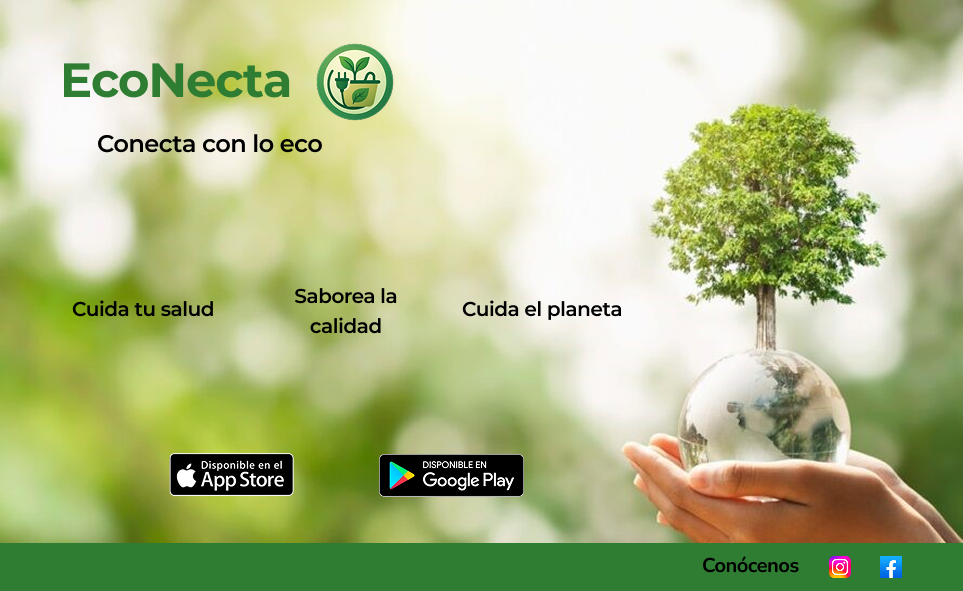

# DIU - Practica 3, entregables

Grupo: DIU1.JaviManuel Curso: 2024/25

Miembros:
 * :bust_in_silhouette:  Javier Ruiz Mondragón    :octocat:     
 * :bust_in_silhouette:  Manuel Jesús Junquera Lobón    :octocat:
 

## 1. Moodboard

Con el siguiente moodboard se pretende dar una idea general sobre la propuesta visual que va a representar nuestro proyecto EcoNecta, el cual está enfocado en conectar a las personas con lo natural, lo ecológico y lo sostenible. Donde a través de una selección de colores, tipografías, iconografía, imágenes y logotipo, establecemos visualmente una estilo único que  comunica los valores fundamentales del proyecto: sostenibilidad, frescura, cercanía y conciencia ambiental.

## 2. Landing Page

Falta poner detalles todavia

## 3. Guidelines

## 4. Layout hi-fi

## 5. Valoración de la práctica / Conclusiones

