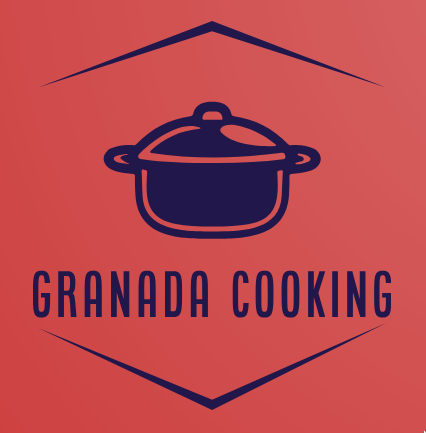
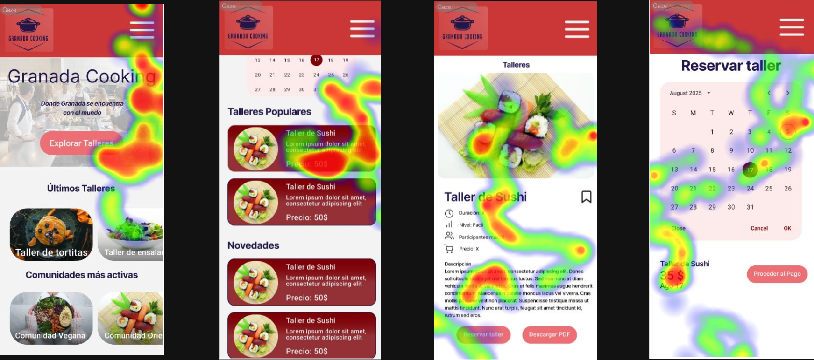
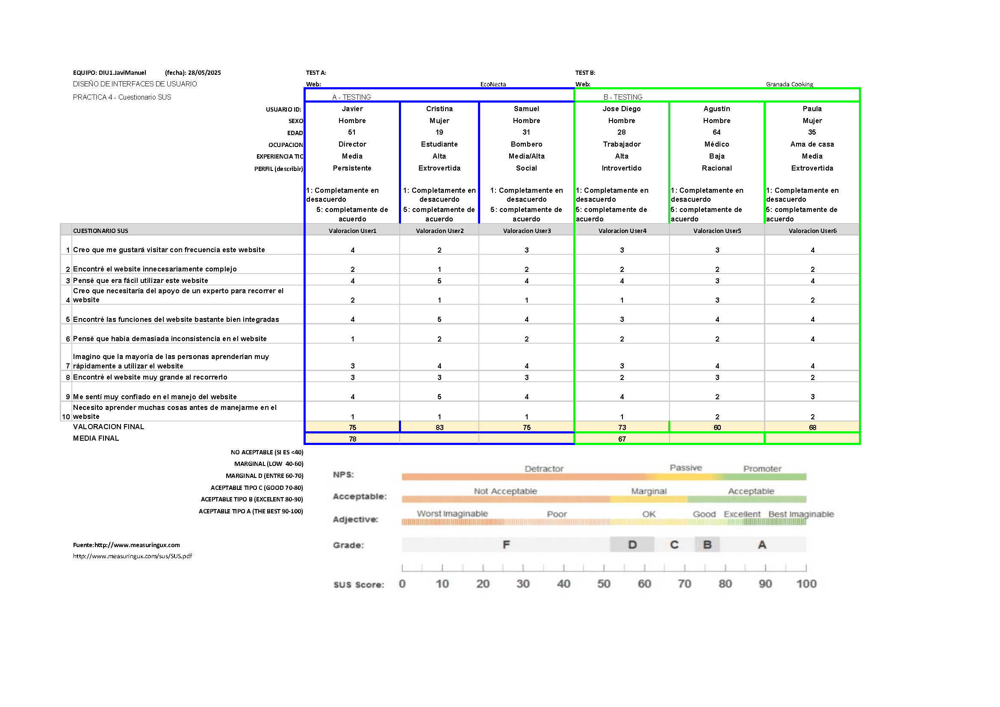

# Usability Report

#### Evaluación de usabilidad del proyecto del caso B

---

### Granada Cooking

### 30/05/2025

---
#### Logo

---
#### Enlace del GitHub

https://github.com/VeraJose05/UX_CaseStudy

---
### Realizado por:

Realizado por el equipo JaviManuel.

Miembros:
* Javier Ruiz Mondragón
* Manuel Jesús Junquera Lobón

Nuestra experiencia cubre algunos aspectos como pueden ser el diseño de aplicaciones móviles o la elaboración de sitios web con sus respectivas interfaces de usuario. También disponemos de conociminetos sobre como debe ser una aplicación que tenga una buena usabilidad y accesibilidad.

---
## 1 DESCRIPCIÓN DEL WEBSITE

Se trata de una aplicación orientada a personas interesadas en perfeccionar sus habilidades culinarias mediante formación en línea donde a través de una amplia oferta de cursos, se permite acceder a contenido exclusivo y a recetas guiadas por chefs profesionales de diferentes regiones de España.

Para conseguir lo anterior, han implementado diferentes servicios o funcionalidades que vienen llegando a ser talleres a los que se pueden apuntar las personas , comunidades en función de tus gustos, comentarios y mucho más.

---
## 2 RESUMEN EJECUTIVO

Lo primero que hemos podido observar aparte de las funcionalidades descritas anteriormente ha sido una interfaz clara y sencilla con buenos niveles de contraste además de una tipografía e iconos simples y legibles que no producen dificultades a la hora de leer. La paleta de colores que se ha usado esta formada por colores rojizos y calurosos lo cual aporta una sensación de cercanía para aquellos dispuestos a entrar en el mundo de la cocina.

Sin embargo, durante la navegación hemos podido observar algunos problemas con la disposición de los botones (reservar taller, descargar PDF ) los cuales aparecen al final de la página con unos colores poco llamativos lo cual hace que no sea algo que se vea a primera vista. Esto puede afectar directamente a la navegación de los usuarios, especialemnte de aquellos que no están muy familiarizados con las tecnologías.

---
## 3 METODOLOGIA 

#### Metodología de usabililidad

La metodología y técnicas usadas consisten en la técnica A/B testing para medir dos prototipos para un producto muy similar y otras técnicas como cuestionario SUS (System Usability Scale) , Eye Tracking o checklist de usabilidad.

Para ello, hemos seleccionado a varias personas de nuestro entorno para la realización de los tests, para darle un enfoque los más objetivo posible, sin que nuestros conocimientos influyan en las decisiones tomadas por los usuarios que realizan los tests.

#### Test de usuarios: Participantes

Los usuarios reales que se han elegido para participar en este estudio y a los que se les realizarán pruebas futuras son:

| Usuarios    | Sexo/Edad     | Ocupación   |  Exp.TIC    | Personalidad | Plataforma | TestA/B
| ------------- | -------- | ----------- | ----------- | -----------  | ---------- | ----
| Javier          | H / 51   |  Director    | Media       | Persistente | Windows      | A 
| Cristina         | M / 19   | Estudiante    | Alta        | Extrovertida | Móvil    | A 
| Samuel         | H / 31   | Bombero    | Media/Alta        | Social | Linux    | A 
| Jose Diego          | H / 28   | Trabajador  | Alta        | Introvertido       |Windows       | B 
| Agustín         | H / 64   | Médico     | Baja       | Racional     |Móvil       | B 
| Paula         | M / 35   | Ama de casa     | Media       | Extrovertida     |Móvil       | B 

#### Resultados obtenidos

---
#### Eye Tracking

Este test se llevó a cabo para analizar el comportamiento de los usuarios mientras realizan una tarea especifica dentro del caso B.

La tarea a realizar es la siguiente:
* Acceder a los tallerres disponibles, escoger uno y  finalmente reservarlo.

Los objetivos de este estudio son:

* Identificar áreas de interés (AOI) en las interfaces de usuario.
* Analizar patrones de fijación y movimientos oculares.
* Evaluar la usabilidad de las plataformas en función del comportamiento visual de los usuarios.

#### Conclusiones del eye tracking

Con este test hemos comprobado que lo primero en lo que se fijan las personas al entrar al sitio web es el banner para explorar talleres lo cual es algo positivo ya que está es la principal funcionalidad que nos ofrece este sitio.

Más adelante comprobamos que una vez seleccionada la opción de explorar talleres, lo siguiente que nos aparece por pantalla son los talleres recientemente añadidos y los talleres más populares, recibiendo estos últimos la principal atención del usuario.

Una vez seleccionado un taller, nos encontramos con toda la información del taller y las opciones de reserva y descraga en pdf de este. Aqui nos hemos dado cuenta como los usuarios se fijan por igual en toda la descripción del taller. Sin embargo, los botones de reservar y descargar el PDF no reciben mucha atención del usuario hasta que no se tiene la intención de reservarlo, por lo que se concluye que no llaman mucho la atención.

Por último, accedemos a la pantalla para reservar el taller donde se selecciona la fecha y se confirma la compra. Etse apartado está bien diseñado ya que se puede ver como el usuario ha distinguido bien los distintos apartados además de haber identificado claramente el botón de pago.

Finalizamos comentando que ambos usuarios han tardado una media de unos 20 segundos en llegar a la pantalla final por lo que se entiende que es bastante eficiente el sitio en cuanto a navegación y busqueda además de que están bien distribuidos la mayoría de los elementos.

---
#### Cuestionario SUS (System Usability Scale Test)

Esta herramienta nos ayudará a medir la usabilidad de los dos casos A y B. Para ello, se presentará a los usuarios un cuestionario de unas 10 preguntas simples. Este cuestionario tiene como opciones de respuesta un valor entre 1 - 5 , que van desde "Completamente en desacuerdo" hasta "Completamente de acuerdo". Las preguntas que aparecen tiene como objetivo estudiar el nivel general de usabilidad del sistema.

Los resultados obtenidos junto a la valoración final son los siguientes:

#### Conclusiones del cuestionario SUS

* El caso A (el nuestro) ha obtenido una puntuación media de 78/100, lo que deja un SUS Score de "Good" según la escala adjetiva. La valoración final deja un nivel de usabilidad aceptable.
* El caso B (el de otros compañeros de clase) ha obtenido una puntuación media de 67/100, lo que deja un SUS Score de "OK" según la escala adjetiva. La valoración final deja un grado de usabilidad medianamente aceptable.

---
#### Checklist de usabilidad

[Completar]

## 4 CONCLUSIONES 

Como conclusión se nos presenta una interfaz clara y sencilla con buenos niveles de contraste, lo cual favorece a la lectura y la navegación. También se ha observado una  tipografía e iconos simples y legibles que no producen dificultades a la hora de leer.

Sin embargo, hemos podido comprobar como algunos botones para realizar determinadas acciones no tienen una buena posición dentro de la página, lo cual puede hacer un poco más complicada la navegación de los usuarios afectando directamente a su satisfacción/experiencia, especialmente de aquellos que no no están muy familiarizados con las tecnologías.

A pesar del problema de los botones y del diseño un poco confuso en algunos momentos,los demás aspectos están bien implementados y da una sensación de aplicación móvil bastante buena.

#### Incidencias

No ha habido ningún tipo de incidencia.

#### Recomendaciones y propuesta de mejoras: 

Como puntos de mejora , se podría dar un lavado al diseño visual y a la estrcuitra de los elementos para que fuese más accesible para aquellas personas con algun tipo de deficiencia o las que no están muy acostumbradas al uso de las nuevas tecnologías. Todo esto afectaría positivamente a los usuarios y a la aplicación aportando mejores experiencias y sensaciones.

#### Valoración de la prueba de usabilidad (self-assesment)

Las pruebas de usabilidad nos han resultado bastante útiles a la hora de analizar la aplicación "Granada Cooking". Mediante el uso de distintos test y del método A/B testing hemos podido identificar de manera más clara y precisa cuales son sus puntos fuertes y las áreas a mejorar.

También hemos podido ver desde otra perspectiva posibles cambios que se podrían implementar gracias al uso de distintos participantes a los que se les han realizado diversos test.

Gracias al uso de test como el eye tracking, los cuationarios SUS y el checklist de usabilidad hemos podido obtener información sobre áreas distintas ofreciendonos una visión más grande y clara sobre toda la aplicación.

Como conclusión, las pruebas nos han sido muy beneficiosas y las técnicas empleadas han demostrado su eficacia, proporcionado información valiosa para implementar futuras mejoras y aumenatr positivamente las experiencia del usuario.
