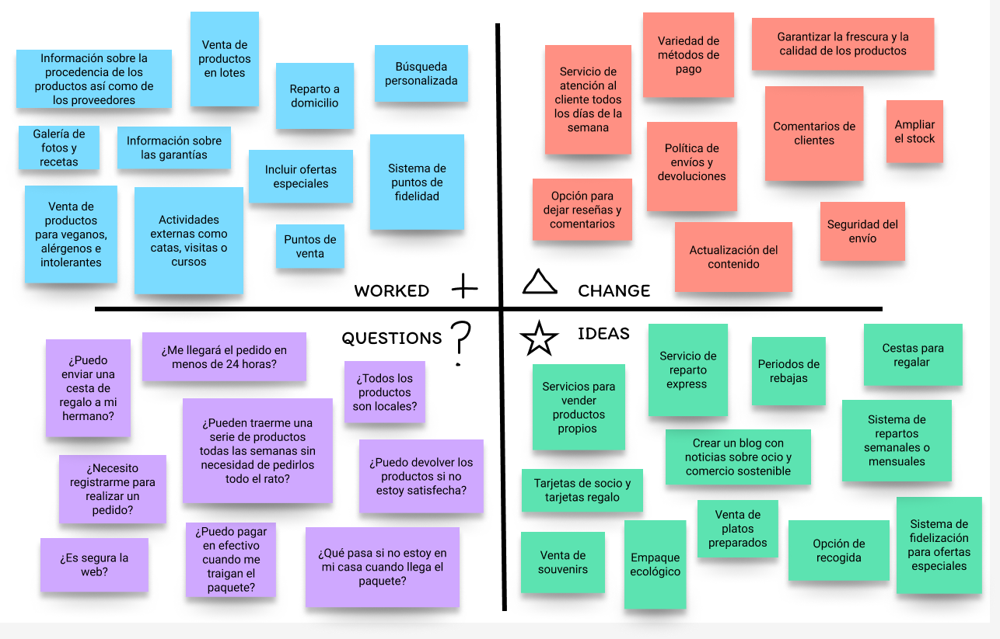
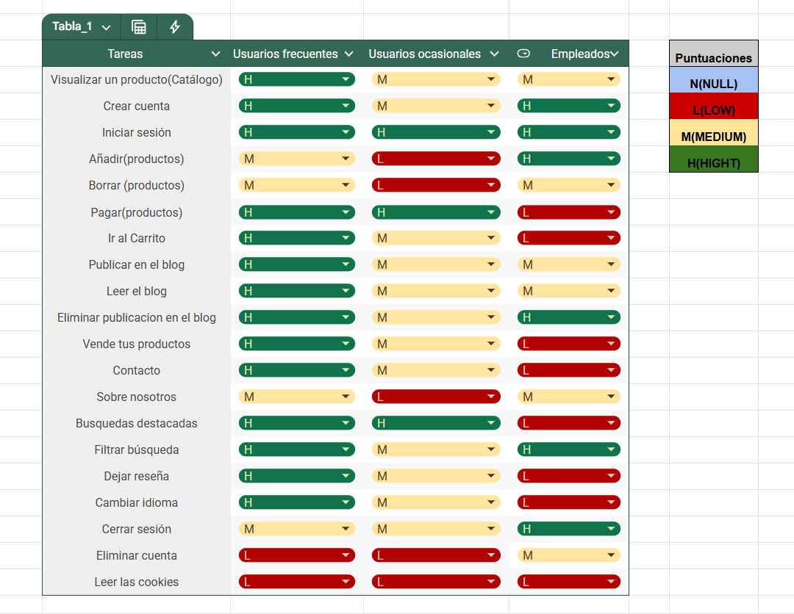
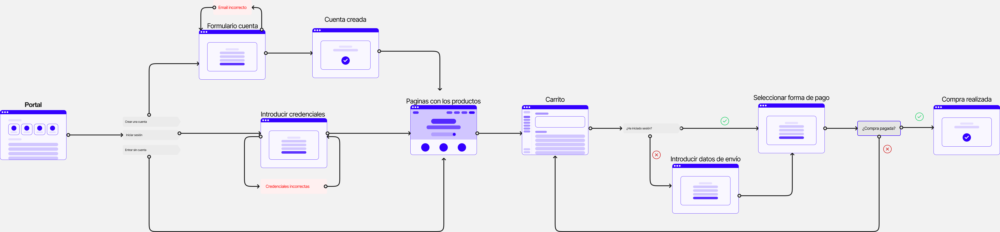
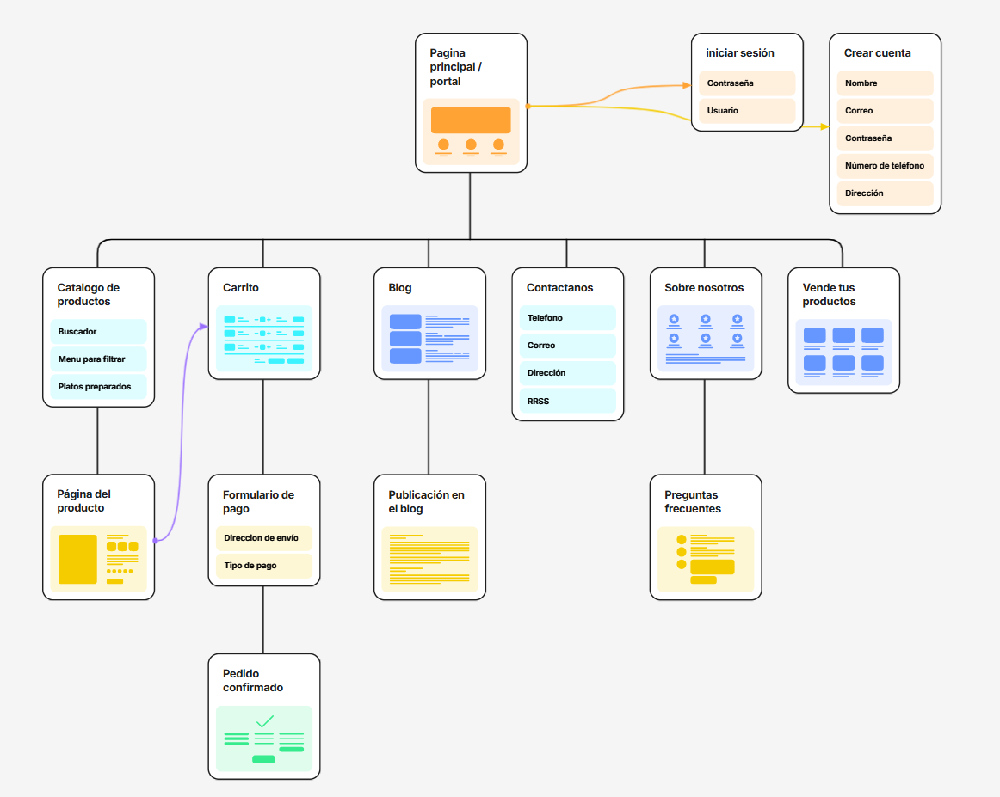

# DIU25
#### Prácticas Diseño Interfaces de Usuario (Tema: El ocio y comercio sostenible |  Subtema: Mercados ecológicos ) 

---
Enlace al repositorio -> https://github.com/javiruizz/UX_CaseStudy.git

Grupo: DIU1_JaviManuel  

Curso: 2025/26 

Actualizado: 17/05/2025

---
**Proyecto:** EcoNecta

 

**Descripción:** 
EcoNecta es una plataforma diseñada para quienes buscan un estilo de vida más sostenible y saludable. A través de nuestra app, ofrecemos acceso a productos ecológicos directamente de agricultores y ganaderos locales, fomentando así el comercio justo y la producción responsable. Además, brindamos una experiencia completa con contenido útil y cercano: actividades, recetas, blogs y más, pensados para ayudarte a mejorar tus hábitos y conectar con una comunidad comprometida con el bienestar del planeta. Por no hablar de la posiblidad de venta de productos propios para todos aquellos que estén interesados.

 

**Propuesta de valor:**
EcoNecta ofrece una plataforma centrada en la compra y venta de productos ecológicos, conectando directamente a consumidores con productores locales. Nuestro objetivo es impulsar un comercio sostenible y consciente, al tiempo que promovemos un ocio saludable. Además, enriquecemos la experiencia del usuario con actividades, eventos, recetas, blogs y otros recursos que fomentan un estilo de vida eco y accesible para todos.

 

**Logotipo:** 

 

**Eslogan:**

---
**Miembros:**
 * :bust_in_silhouette:  Javier Ruiz Mondragón        
 * :bust_in_silhouette:  Manuel Jesús Junquera Lobón  
   
 

**GitHub:**
 * :octocat:  Javier Ruiz Mondragón -> https://github.com/javiruizz 
 * :octocat:  Manuel Jesús Junquera Lobón -> https://github.com/manujes1

---

 

# Proceso de Diseño 
## Paso 1. UX User & Desk Research & Analisis 

 

### 1.1 User Reseach Plan
El proyecto consiste en la realización del análisis de una página web que ofrece servicios en base al ocio y comercio sostenible, concretamente especializada en mercados ecológicos. El principal propósito de este estudio es mejorar la experiencia de los usuarios con la web, así como de mejorar varios aspectos de esta cómo pueden ser conseguir nuevos clientes, además de proveedores con nuevos productos.

Para la realización de esté análisis se van a establecer una serie de objetivos que se pretenden cumplir, entre ellos encontramos objetivos de distintos tipos como pueden ser comerciales, económicos, personales y otros distintos. Algunos ejemplos de este tipo de objetivos pueden ser mejorar los beneficios y el número de usuarios, garantizar la seguridad y la protecciónd de datos y un crecimiento profesional junto con la mejora de aptitudes como el pensamineto crítico y la capacidad de resolución de problemas.

En adición, también se va a establecer que tipo de información se desea recolectar además de los distintos métodos de investigación que se van a emplear. Por no hablar de la importancia de realizar un estudio de los posibles participantes/usuarios así como del estudio de la competencia.

Por último, en cuanto a nuestra experiencia en este campo cabe recalcar que como interesados y observadores tenemos bastante experienca ya que nosotros mismos y gente de nuestro alrededor realiza diariamente compras de productos a través de internet. Por otra parte, como diseñadores es cierto que no contamos con mucha experinecia con este tipo de aplicaciones.

Para más información -> [User Research Plan](P1/USER_RESEARCH_PLAN.pdf)

---
### 1.2 Personas

Hemos escogido a Rocío como persona ya que nos gustaría tener el perfil de una persona de edad avanzada que no termina de estar familiarizada del todo con las tecnologías. De esta forma, podemos ver la página desde otra perspectiva que nos permite ver distintos puntos a mejorar para que la experiencia de todo el mundo sea la óptima. Por último, su pasión por la cocina la hace una clienta ideal, al ser uno de los principales servicios de la página la venta de alimentos ecológicos y frescos.

Hemos escogido a Pablo como persona ya que refleja el perfil de una persona deportista que además tiene conocimientos médicos, por lo que le gusta estar informado de los mejores productos para sus pacientes. Él, a diferencia de Rocío sí tiene manejo de la tecnología, está acostumbrado a tratar con interfaces de usuario, motivo por el que es más exigente con las IU que Rocío. El suegro de Pablo está enfermo, necesita hacer una dieta saludable, así que Pablo le hace la compra.

 

---
### 1.3 User Journey Map

Rocío se ha visto en la necesidad de adentrarse en internet para encontrar productos locales de gran calidad, en consecuencia, se ha encontrado con la página web Valle&Vega.
Sin embargo, la experiencia ha sido distinta a la que se imaginaba ya que le ha costado un poco encontrar los productos que buscaba además de tener problemas con el proceso de compra, aunque al final haya conseguido su objetivo en el tiempo que buscaba. Este caso es un poco especial ya que aunque Rocío se haya quedado con un mal sabor de boca,planteándose si volver a usar la web, hay que tener en cuenta la edad de Rocío y que no está muy familiarizada con la tecnología, aun así, nos aporta una visión distinta que nos puede ayudar a la hora de encontrar ideas para mejorar la página y la experiencia de los usuarios.

Pablo está acostumbrado a hacer la compra de su suegro Luis, el cual padece una enfermedad instestinal y no puede hacerla por si mismo. Él lo ayuda a elegir los productos correctos. Un día, Luis le pide a Pablo que le haga la compra. Él, como andaba un poco justo de tiempo, busca en internet y se encuentra con la web de Bioencasa. En dicha web encuentra los productos que iba buscando y la interfaz le permite satisfacer las necesidades fundamentales que tenía. Sin embargo, Pablo estaba un poco irascible debido a la falta de tiempo, por lo que le molestó bastante que le apareciera todo el rato un pop-up cada vez que añadía un producto a la cesta y el hecho de que le pidan que se creara una cuenta en la web para poder hacer su pedido.

---
### 1.4 Competitive Analysis

Para comenzar, de entre los casos propuestos nos hemos decantado por Valle&Vega (https://valleyvega.org/) , la cual es una asociación para la producción y comercialización kilómetro 0 de alimentación ecológica en la provincia de Granada. La razón por la que hemos elegido está es debido a que nos ha llamado más la atención, además de parecernos buenísima idea para dar a conocer comercios locales o incluso ganaderos y  agricultores de nuestra propia provincia, sirviendo como impulso para la economía y en consecuencia su crecimiento y expansión.

A continuación, para hacer el competitive analysis hemos elegido las siguientes páginas, Bioencasa (https://bioencasa.es/) y EcoJaral (https://ecojaral.com/) . Ambas son páginas que ofrecen una amplia variedad de productos ecológicos de la provincia de Granada. El motivo de esta elección es que ambas comparten muchas similitudes, al proporcionar productos que provienen de nuestra propia provincia al igual que Valle&Vega.

Haciendo un breve resumen, en Bioencasa podemos observar que aunque ofrece casi la misma variedad de productos que Valle&Vega, está pagina ofrece un diseño más llamativo y claro, haciéndola más intuitiva además de ofrecer otros servicios no presentes en Valle&Vega como pueden ser repartos a domicilio. Por otra parte Ecojaral tmabién presenta una página más clara e intuitiva que en Valle&Vega, por no hablar de que implementa una buena mecánica para mejorar la experiencia de los usuarios como son los puntos de fidelidad.

Finalmente, podemos observar como las páginas presentan unas puntuaciones similares, haciendo que ninguna destaque sobre las demás. Sin embargo , aunque las páginas nos han parecido interesantes y nos han permitido ver muchos aspectos a mejorar, nos vamos a decantar por Bioencasa, ya que ésta es la más completa y la que nos va a ayudar más a la hora de implementar mejoras. 

---
### 1.5 Usability Review
Vamos a evaluar diferente aspectos sobre la pagina web Bioencasa y si tiene margen de mejora. En dicha evaluación se van a tener en cuenta varios apartados, como lo son la funcionalidad, la navegación la búsqueda o el rendimiento de la página.

Para ver la evaluación -> [ENLACE A USABILITY REVIEW](P1/Usability-review.pdf)

Como podemos ver, Bioencasa ha obtenido una puntuación de 82/100, destacando positivamente en la mayoría de apartados. La página podría mejorar ofreciendo diferentes níveles de usabilidad para diferentes usuarios y permitiendo hacer una configuración adaptada al usuario.

Debería ofrecer una explicación más extensa cuando cometemos un error en los formularios, ofreciendo ayuda, como ejemplos sobre qué debería de poner. Además, estaría muy bien que ofreciera busquedas avanzadas como, por ejemplo, productos más comprados, más recientes, mejor valorados, etc.

 

---
## Paso 2. UX Design  
---
### 2.1 Reframing / IDEACION: Feedback Capture Grid / Empathy map 

#### 2.1.1 Malla receptora de información

Vamos a realizar una malla receptora de información donde utilizaremos toda la información obtenida de nuestras personas así como aquella
que tenemos nosotros mismos, es decir, nuestra experiencia y la que hemos obtenido de las distintas páginas analizadas anteriormente. 
Dicha malla se va a dividir en cuatro apartados principales que hemos considerado los más importantes:
 * Aspectos positivos (Worked) -> son cosas que sabemos que funcionan y que hemos podido observar de distintas páginas web.
 * Críticas constructivas (Change) -> son cosas a tener en cuenta para cambiar y mejorar en el futuro.
 * Preguntas de usuario (Questions) -> posibles preguntas que se pueden hacer los usuarios
 * Ideas de mejora (Ideas) -> son las ideas que nos gustaría implementar o al menos tener en cuenta en el futuro desarrollo.

#### 2.1.2 Mapa de empatía

Vamos a diseñar un mapa de empatía donde reuniremos tanto el comportamineto de nuestras personas y nuestra experiencia para un futuro diseño. 
El mapa se va a dividir en seis partes principales las cuales son:
* Think & Feel -> recoge todo en cuanto emociones, pensamientos, motivaciones y necesidades.
* Ear -> se basa en todo lo que se ha escuchado de diferentes sitios y personas.
* See -> es todo aquello que se ha visto.
* Say & Do -> se trata de todo lo que se dice y hace.
* Pain -> obstáculos y dificultades que han tenido.
* Gain -> todos los benefios, éxitos y objetivos.

Para entender el mapa es necesario tener en cuenta la siguiente leyenda:
* Color Morado -> representa la persona de Pablo.
* Color Rojo -> representa la persona de Rocío.
* Color Amarillo -> representa nuestra experiencia.

#### 2.1.3 Conclusiones
Antes de comenzar con el diseñó de nuestro proyecto, vamos a realizar un resumen de las cosas más importantes que hemos visto. En la malla receptora de información hemos podido
observar ideas que ya funcionan las cual se van a implemetar y por otro lado tambien se nos han ocurrido algunas nuevas que nos gustaría poner en marcha como el servicio de reparto express o la venta de platos preparados. A continucación, hemos podido obetener del mapa de empatía una idea de lo que piensa y hace la gente, donde caben destacar algunos puntos como las difucultades que tienen algunas personas como la desconfianza hacia un servicio o los malos comentarios, mientras que por otro lado tenemos puntos positivos a nombrar como las variedad de productos y la venta de productos frescos,locales y saludables.

---
### 2.2 ScopeCanvas

Con el siguiente ScopeCanvas se pretende resumir nuestro proyecto, para ello, se van a tratar distintos puntos a destacar como 
las necesidades de nuestros usuarios, objetivos que queremos lograr como organización tanto a largo como a corto plazo, nuestro propósito general,
acciones que queremos que nuestros usuarios lleven a cabo y métricas que se van a tener en cuenta a la hora de analizar el progreso del proyecto.

[ScopeCanvas](P2/ScopeCanvas.pdf)

---
### 2.3 User Flow (task) analysis 
#### 2.3.1 User Task Matrix

Hemos analizado las tareas más importantes, teniendo en cuenta 3 valores de relevancia(expuestos a la derecha de la tabla), y valorándolos en 3 posibles usuarios de nuestro sitio web. Nos ha parecido interesante diferenciar al usuario ocasional del usuario frecuente. Las tareas están ordenadas por importancia, siendo la de arriba del todo la más prioritaria. 

#### 2.3.2 User/Task Flow

En el siguiente Flow Design se representa el flujo de las principales tareas de nuestro sitio web. Para leerlo tan solo hay que seguir las flechas de izquierda a derecha.

---
### 2.4 IA: Sitemap + Labelling 

#### 2.4.1 Sitemap

En el siguiente Sitemap podemos observar la estrcutura jerárquica de nuestro sitio web. Cada nivel de profundidad está marcado con un color diferente. El color de las flechas no tienen ningún significado en especial(de ahí que no haya leyenda).

#### 2.4.2 Labelling

En el siguiente Labelling podemos encontrar el etiquetado correspondiente al sitemap.

[Labelling](P2/Labelling.pdf)

---
### 2.5 Wireframes

#### a) Bocetos a papel

En el siguiente PDF podemos encontrar 8 bocetos hechos a papel. Donde podemos encontrar el diseño básico de las páginas:
- Catálogo: donde se exponen los diferentes productos disponibles para comprar.
- Iniciar sesión: interfaz donde podemos iniciar sesión.
- Crear cuenta: Página para crear una cuenta en el sistema.
- Producto: En este boceto se representa cómo será la página donde se detalla cada producto.
- Carrito: Lugar donde se hace un resumen de la compra realizada hasta ahora y se nos brinda la posibilidad de pagar.
- Blog: Un lugar donde se pueden publicar datos curiosos relacionados con el comercio sostenible.
- Contacto: Aquí se recogen todos los datos de contacto de los organizadores del negocio, para que de esta forma los clientes pueden comunicarse fácilmente.
- Vende tus productos: En este novedoso apartado, queríamos dar la posibilidad a nuestros usuarios de poder vender sus productos en nuestra página web a través de una plantilla que deben rellenar para cada producto, que más tarde será validado por nosotros.

[Bocetos](P2/bocetos_P2_DIU.pdf)

#### b) Wireframe preliminar en Figma

Procedemos a hacer los diseños de los bocetos a papel en Figma

[Bocetos Figma](P2/bocetos_figma.pdf)

#### c) Versión con GRID LAYOUT

En el siguiente enlace puede descargar el .fig en el que se encuentra el diseño responsive de nuestra página utilizando Grid Layout.

[Diseño Responsive](P2/Diseno_responsive.fig)

 

---
## Paso 3. Mi UX-Case Study (diseño)
### 3.1 Moodboard

Con el siguiente moodboard se pretende dar una idea general sobre la propuesta visual que va a representar nuestro proyecto EcoNecta, el cual está enfocado en conectar a las personas con lo natural, lo ecológico y lo sostenible. Donde a través de una selección de colores, tipografías, iconografía, imágenes y logotipo, establecemos visualmente una estilo único que  comunica los valores fundamentales del proyecto: sostenibilidad, frescura, cercanía y conciencia ambiental.

---
### 3.2 Landing Page

A continuación podemos encontrar nuestro Landing Page. En él, a través de una imagen que refuerza la idea el comercio sostenible y de 3 mensajes directos que ayudan a hacer la propuesta más deseable para el cliente animamos al cliente a descargar la aplicación.

---
### 3.3 Guidelines

Los patrones que hemos decidido utilizar para la creación del prototipo son:
- Onboarding: Hemos creado una pantalla de bienvenida.
- Carousel: Nuestra apliación cuenta con una sección destacada de imágenes.
- Search: Contamos con una barra de búsqueda para fistrar los productos.
- Acerca de: Tenems un apartado donde mostramos la información de la empresa.
- Formulario de entrada de datos: Nuestro diseño cuenta con varios formularios, de resgistro, de inicio de sesión, para vender productos dentro de la página, etc.
- Article List: Tenemos una lista de productos.
- Menú: Contamos con un menú en nuestro catálogo de productos.
- Shopping cart: En EcoNecta existe un proceso de pago detallado.
  
- **Wizards: Nuestro diseño utiliza el patrón wizard en varios apartados.**
  
  - *Proceso de pago*
    - Seleccionamos el icono del carrito situado en la esquina superior derecha para ver el resumen de los que hemos añadido a la cesta de la compra hasta el momento. En el podemos ver el importe a pagar.
    - Tras seleccionar el botón de pago, rellenamos la información personal(en caso de estar registrado aparecerá ya rellena). Y seleccionamos el método de pago deseado(pago con tarjeta o PayPal).
    - Una vez seleccionada la tarjeta, accederemos a una nueva página donde tendremos que rellenar la información de la tarjeta y seleccionar el botón para confirmar el uso de dicha tarjeta.
      
  - *Proceso de registro*
    - Al entrar en la aplicación vemos que en la esquina superior derecha hay un icono de usuario, pinchamos en él y se nos pedirá la información de inicio de sesión.
    - Al no teber una cuenta creada, pincharemos en el botón de "no tengo cuenta todavía".
    - Se nos llevará a un formulario de registro donde deberemos rellenar información personal y pulsar en el botón de "Crear Cuenta".
      
  -  *Añadir productos/Publicar en el blog*
     - En nuestra aplicación se permite publicar productos para poner en venta y añadir publicaciones en el blog. Ambos procesos son simialres.
     - Accedes a un formulario que debes rellenar con los datos acordes a la acción que queremos llevar a cabo.
     - Pulsamos en el botón de "publicar"/"enviar".

---
### 3.4 Mockup

En esta parte buscamos reflejar con precisión la experiencia del usuario final, integrando elementos visuales definidos en el moodboard, así como componentes interactivos que simulan la funcionalidad real de la interfaz. Para asegurar una navegación clara, accesible y coherente, se ha utilizado Figma,donde se han incluido diversas animaciones. En adición, también se han usado interacciones mediante menús, botones y tarjetas, lo que permite una visualización precisa del flujo de un usuario en entornos móviles. Este layout no solo representa el aspecto visual, sino también el funcionamiento esperado de la app, ayudando a una posterior fase de desarrollo e implementación.

**Enlace a figma:**
https://www.figma.com/design/SEPZABWTM9ji8luZB7NLhH/layout-hi-fi?t=NX5bp4nb2HtKaGe1-1

---
### 3.5 ¿My UX-Case Study?

 

## Paso 4. Pruebas de Evaluación 

### 4.a Reclutamiento de usuarios 

-----

>>> Breve descripción del caso asignado (llamado Caso-B) con enlace al repositorio Github
>>> Tabla y asignación de personas ficticias (o reales) a las pruebas. Exprese las ideas de posibles situaciones conflictivas de esa persona en las propuestas evaluadas. Mínimo 4 usuarios: asigne 2 al Caso A y 2 al caso B.

| Usuarios | Sexo/Edad     | Ocupación   |  Exp.TIC    | Personalidad | Plataforma | Caso
| ------------- | -------- | ----------- | ----------- | -----------  | ---------- | ----
| User1's name  | H / 18   | Estudiante  | Media       | Introvertido | Web.       | A 
| User2's name  | H / 18   | Estudiante  | Media       | Timido       | Web        | A 
| User3's name  | M / 35   | Abogado     | Baja        | Emocional    | móvil      | B 
| User4's name  | H / 18   | Estudiante  | Media       | Racional     | Web        | B 

### 4.b Diseño de las pruebas 
 
-----

>>> Planifique qué pruebas se van a desarrollar. ¿En qué consisten? ¿Se hará uso del checklist de la P1?

### 4.c Cuestionario SUS
 
----

>>> Como uno de los test para la prueba A/B testing, usaremos el **Cuestionario SUS** que permite valorar la satisfacción de cada usuario con el diseño utilizado (casos A o B). Para calcular la valoración numérica y la etiqueta linguistica resultante usamos la [hoja de cálculo](https://github.com/mgea/DIU19/blob/master/Cuestionario%20SUS%20DIU.xlsx). Previamente conozca en qué consiste la escala SUS y cómo se interpretan sus resultados
http://usabilitygeek.com/how-to-use-the-system-usability-scale-sus-to-evaluate-the-usability-of-your-website/)
Para más información, consultar aquí sobre la [metodología SUS](https://cui.unige.ch/isi/icle-wiki/_media/ipm:test-suschapt.pdf)
>>> Adjuntar en la carpeta P4/ el excel resultante y describa aquí la valoración personal de los resultados 

### 4.d A/B Testing
 
-----

>>> Los resultados de un A/B testing con 3 pruebas y 2 casos o alternativas daría como resultado una tabla de 3 filas y 2 columnas, además de un resultado agregado global. Especifique con claridad el resultado: qué caso es más usable, A o B?

### 4.e Aplicación del método Eye Tracking 

----

>>> Indica cómo se diseña el experimento y se reclutan los usuarios. Explica la herramienta / uso de gazerecorder.com u otra similar. Aplíquese únicamente al caso B.

  
>>> Cambiar esta img por una de vuestro experimento. El recurso deberá estar subido a la carpeta P4/  

>>> gazerecorder en versión de pruebas puede estar limitada a 3 usuarios para generar mapa de calor (crédito > 0 para que funcione) 

### 4.f Usability Report de B
 
-----

>>> Añadir report de usabilidad para práctica B (la de los compañeros) aportando resultados y valoración de cada debilidad de usabilidad. 
>>> Enlazar aqui con el archivo subido a P4/ que indica qué equipo evalua a qué otro equipo.

>>> Complementad el Case Study en su Paso 4 con una Valoración personal del equipo sobre esta tarea

 

## Paso 5. Exportación y Documentación 

### 5.a Exportación a HTML/React
 
----

>>> Breve descripción de esta tarea. Las evidencias de este paso quedan subidas a P5/

### 5.b Documentación con Storybook

----

>>> Breve descripción de esta tarea. Las evidencias de este paso quedan subidas a P5/

 

## Conclusiones finales & Valoración de las prácticas

>>> Opinión FINAL del proceso de desarrollo de diseño siguiendo metodología UX y valoración (positiva /negativa) de los resultados obtenidos. ¿Qué se puede mejorar? Recuerda que este tipo de texto se debe eliminar del template que se os proporciona 

