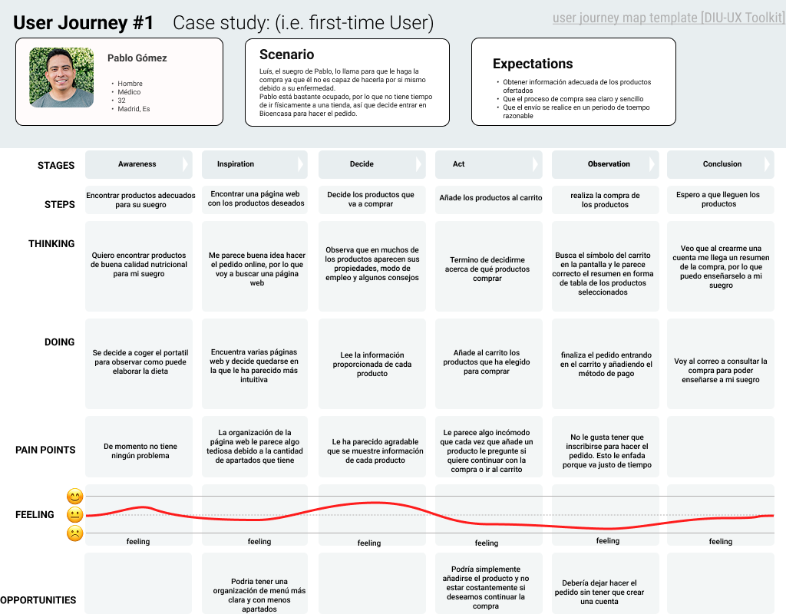

# DIU25
#### Prácticas Diseño Interfaces de Usuario (Tema: El ocio y comercio sostenible |  Subtema: Mercados ecológicos ) 

---
Enlace al repositorio -> https://github.com/javiruizz/UX_CaseStudy.git

Grupo: DIU1_JaviManuel  

Curso: 2025/26 

Actualizado: 17/05/2025

---
**Proyecto:** EcoNecta

 

**Descripción:** 
EcoNecta es una plataforma diseñada para quienes buscan un estilo de vida más sostenible y saludable. A través de nuestra app, ofrecemos acceso a productos ecológicos directamente de agricultores y ganaderos locales, fomentando así el comercio justo y la producción responsable. Además, brindamos una experiencia completa con contenido útil y cercano: actividades, recetas, blogs y más, pensados para ayudarte a mejorar tus hábitos y conectar con una comunidad comprometida con el bienestar del planeta. Por no hablar de la posiblidad de venta de productos propios para todos aquellos que estén interesados.

 

**Propuesta de valor:**
EcoNecta ofrece una plataforma centrada en la compra y venta de productos ecológicos, conectando directamente a consumidores con productores locales. Nuestro objetivo es impulsar un comercio sostenible y consciente, al tiempo que promovemos un ocio saludable. Además, enriquecemos la experiencia del usuario con actividades, eventos, recetas, blogs y otros recursos que fomentan un estilo de vida eco y accesible para todos.

 

**Logotipo:** 

 

**Eslogan:**

---
**Miembros:**
 * :bust_in_silhouette:  Javier Ruiz Mondragón        
 * :bust_in_silhouette:  Manuel Jesús Junquera Lobón  
   
 

**GitHub:**
 * :octocat:  Javier Ruiz Mondragón -> https://github.com/javiruizz 
 * :octocat:  Manuel Jesús Junquera Lobón -> https://github.com/manujes1

---

 

# Proceso de Diseño 
## Paso 1. UX User & Desk Research & Analisis 

 

### 1.a User Reseach Plan
El proyecto consiste en la realización del análisis de una página web que ofrece servicios en base al ocio y comercio sostenible, concretamente especializada en mercados ecológicos. El principal propósito de este estudio es mejorar la experiencia de los usuarios con la web, así como de mejorar varios aspectos de esta cómo pueden ser conseguir nuevos clientes, además de proveedores con nuevos productos.

Para la realización de esté análisis se van a establecer una serie de objetivos que se pretenden cumplir, entre ellos encontramos objetivos de distintos tipos como pueden ser comerciales, económicos, personales y otros distintos. Algunos ejemplos de este tipo de objetivos pueden ser mejorar los beneficios y el número de usuarios, garantizar la seguridad y la protecciónd de datos y un crecimiento profesional junto con la mejora de aptitudes como el pensamineto crítico y la capacidad de resolución de problemas.

En adición, también se va a establecer que tipo de información se desea recolectar además de los distintos métodos de investigación que se van a emplear. Por no hablar de la importancia de realizar un estudio de los posibles participantes/usuarios así como del estudio de la competencia.

Por último, en cuanto a nuestra experiencia en este campo cabe recalcar que como interesados y observadores tenemos bastante experienca ya que nosotros mismos y gente de nuestro alrededor realiza diariamente compras de productos a través de internet. Por otra parte, como diseñadores es cierto que no contamos con mucha experinecia con este tipo de aplicaciones.

Para más información -> [User Research Plan](P1/USER_RESEARCH_PLAN.pdf)

---
### 1.b Personas

Hemos escogido a Rocío como persona ya que nos gustaría tener el perfil de una persona de edad avanzada que no termina de estar familiarizada del todo con las tecnologías. De esta forma, podemos ver la página desde otra perspectiva que nos permite ver distintos puntos a mejorar para que la experiencia de todo el mundo sea la óptima. Por último, su pasión por la cocina la hace una clienta ideal, al ser uno de los principales servicios de la página la venta de alimentos ecológicos y frescos.

Hemos escogido a Pablo como persona ya que refleja el perfil de una persona deportista que además tiene conocimientos médicos, por lo que le gusta estar informado de los mejores productos para sus pacientes. Él, a diferencia de Rocío sí tiene manejo de la tecnología, está acostumbrado a tratar con interfaces de usuario, motivo por el que es más exigente con las IU que Rocío. El suegro de Pablo está enfermo, necesita hacer una dieta saludable, así que Pablo le hace la compra.

 

---
### 1.c User Journey Map

Rocío se ha visto en la necesidad de adentrarse en internet para encontrar productos locales de gran calidad, en consecuencia, se ha encontrado con la página web Valle&Vega.
Sin embargo, la experiencia ha sido distinta a la que se imaginaba ya que le ha costado un poco encontrar los productos que buscaba además de tener problemas con el proceso de compra, aunque al final haya conseguido su objetivo en el tiempo que buscaba. Este caso es un poco especial ya que aunque Rocío se haya quedado con un mal sabor de boca,planteándose si volver a usar la web, hay que tener en cuenta la edad de Rocío y que no está muy familiarizada con la tecnología, aun así, nos aporta una visión distinta que nos puede ayudar a la hora de encontrar ideas para mejorar la página y la experiencia de los usuarios.

Pablo está acostumbrado a hacer la compra de su suegro Luis, el cual padece una enfermedad instestinal y no puede hacerla por si mismo. Él lo ayuda a elegir los productos correctos. Un día, Luis le pide a Pablo que le haga la compra. Él, como andaba un poco justo de tiempo, busca en internet y se encuentra con la web de Bioencasa. En dicha web encuentra los productos que iba buscando y la interfaz le permite satisfacer las necesidades fundamentales que tenía. Sin embargo, Pablo estaba un poco irascible debido a la falta de tiempo, por lo que le molestó bastante que le apareciera todo el rato un pop-up cada vez que añadía un producto a la cesta y el hecho de que le pidan que se creara una cuenta en la web para poder hacer su pedido.

---
### 1.d Competitive Analysis

Para comenzar, de entre los casos propuestos nos hemos decantado por Valle&Vega (https://valleyvega.org/) , la cual es una asociación para la producción y comercialización kilómetro 0 de alimentación ecológica en la provincia de Granada. La razón por la que hemos elegido está es debido a que nos ha llamado más la atención, además de parecernos buenísima idea para dar a conocer comercios locales o incluso ganaderos y  agricultores de nuestra propia provincia, sirviendo como impulso para la economía y en consecuencia su crecimiento y expansión.

A continuación, para hacer el competitive analysis hemos elegido las siguientes páginas, Bioencasa (https://bioencasa.es/) y EcoJaral (https://ecojaral.com/) . Ambas son páginas que ofrecen una amplia variedad de productos ecológicos de la provincia de Granada. El motivo de esta elección es que ambas comparten muchas similitudes, al proporcionar productos que provienen de nuestra propia provincia al igual que Valle&Vega.

Haciendo un breve resumen, en Bioencasa podemos observar que aunque ofrece casi la misma variedad de productos que Valle&Vega, está pagina ofrece un diseño más llamativo y claro, haciéndola más intuitiva además de ofrecer otros servicios no presentes en Valle&Vega como pueden ser repartos a domicilio. Por otra parte Ecojaral tmabién presenta una página más clara e intuitiva que en Valle&Vega, por no hablar de que implementa una buena mecánica para mejorar la experiencia de los usuarios como son los puntos de fidelidad.

Finalmente, podemos observar como las páginas presentan unas puntuaciones similares, haciendo que ninguna destaque sobre las demás. Sin embargo , aunque las páginas nos han parecido interesantes y nos han permitido ver muchos aspectos a mejorar, nos vamos a decantar por Bioencasa, ya que ésta es la más completa y la que nos va a ayudar más a la hora de implementar mejoras. 

---
### 1.e Usability Review
Vamos a evaluar diferente aspectos sobre la pagina web Bioencasa y si tiene margen de mejora. En dicha evaluación se van a tener en cuenta varios apartados, como lo son la funcionalidad, la navegación la búsqueda o el rendimiento de la página.

Para ver la evaluación -> [ENLACE A USABILITY REVIEW](P1/Usability-review.pdf)

Como podemos ver, Bioencasa ha obtenido una puntuación de 82/100, destacando positivamente en la mayoría de apartados. La página podría mejorar ofreciendo diferentes níveles de usabilidad para diferentes usuarios y permitiendo hacer una configuración adaptada al usuario.

Debería ofrecer una explicación más extensa cuando cometemos un error en los formularios, ofreciendo ayuda, como ejemplos sobre qué debería de poner. Además, estaría muy bien que ofreciera busquedas avanzadas como, por ejemplo, productos más comprados, más recientes, mejor valorados, etc.

 

---
## Paso 2. UX Design  

>>> Cualquier título puede ser adaptado. Recuerda borrar estos comentarios del template en tu documento

### 2.a Reframing / IDEACION: Feedback Capture Grid / EMpathy map 
 
----

>>> Comenta con un diagrama los aspectos más destacados a modo de conclusion de la práctica anterior. De qué carece la competencia?? Tu diagrama puede ser una figura subida a la carpeta P2/

 Interesante | Críticas     
| ------------- | -------
  Preguntas | Nuevas ideas
  
    
>>> Explica el Problema y plantea una hipótesis. Es decir, explica aquí qué 
>>> se plantea como "propuesta de valor" para un nuevo diseño de aplicación propio

### 2.b ScopeCanvas

----

>>> Propuesta de valor, pero ahora en vez de un texto es un ScopeCanvas que has subido a P2/ y enlazado desde aqui. Tambien vale una imagen miniatura del recurso.
>>> No olvides que tu propuesta ya tiene un nombre corto y puedes actualizar la cabecera de este archivo

### 2.b User Flow (task) analysis 
 
-----

>>> Definir "User Map" y "Task Flow" ... enlazar desde P2/ y describir brevemente

### 2.c IA: Sitemap + Labelling 
 
----

>>> Identificar términos para diálogo con usuario (evita el spanglish) y la arquitectura de la información. Es muy apropiado un diagrama tipo sitemap y una tabla que se ampliaría para llevar asociado la columna iconos (tanto para la web como para una app). 

Término | Significado     
| ------------- | -------
  Login  | acceder a plataforma

### 2.d Wireframes
 
-----

>>> Plantear el diseño del layout para Web/movil (organización y simulación). Describa la herramienta usada 

 

## Paso 3. Mi UX-Case Study (diseño)

>>> Cualquier título puede ser adaptado. Recuerda borrar estos comentarios del template en tu documento

### 3.a Moodboard

-----

>>> Diseño visual con una guía de estilos visual (moodboard) 
>>> Incluir Logotipo. Todos los recursos estarán subidos a la carpeta P3/
>>> Explique aqui la/s herramienta/s utilizada/s y el por qué de la resolución empleada. Reflexione ¿Se puede usar esta imagen como cabecera de Instagram, por ejemplo, o se necesitan otras?

### 3.b Landing Page
 
----

>>> Plantear el Landing Page del producto. Aplica estilos definidos en el moodboard

### 3.c Guidelines
 
----

>>> Estudio de Guidelines y explicación de los Patrones IU a usar 
>>> Es decir, tras documentarse, muestre las deciones tomadas sobre Patrones IU a usar para la fase siguiente de prototipado. 

### 3.d Mockup
 
----

>>> Consiste en tener un Layout en acción. Un Mockup es un prototipo HTML que permite simular tareas con estilo de IU seleccionado. Muy útil para compartir con stakeholders

### 3.e ¿My UX-Case Study?
 
-----

>>> Publicar my Case Study en Github... Es el momento de dejar este documento para que sea evaluado y calificado como parte de la práctica
>>> Documente bien la cabecera y asegurese que ha resumido los pasos realizados para el diseño de su producto

 

## Paso 4. Pruebas de Evaluación 

### 4.a Reclutamiento de usuarios 

-----

>>> Breve descripción del caso asignado (llamado Caso-B) con enlace al repositorio Github
>>> Tabla y asignación de personas ficticias (o reales) a las pruebas. Exprese las ideas de posibles situaciones conflictivas de esa persona en las propuestas evaluadas. Mínimo 4 usuarios: asigne 2 al Caso A y 2 al caso B.

| Usuarios | Sexo/Edad     | Ocupación   |  Exp.TIC    | Personalidad | Plataforma | Caso
| ------------- | -------- | ----------- | ----------- | -----------  | ---------- | ----
| User1's name  | H / 18   | Estudiante  | Media       | Introvertido | Web.       | A 
| User2's name  | H / 18   | Estudiante  | Media       | Timido       | Web        | A 
| User3's name  | M / 35   | Abogado     | Baja        | Emocional    | móvil      | B 
| User4's name  | H / 18   | Estudiante  | Media       | Racional     | Web        | B 

### 4.b Diseño de las pruebas 
 
-----

>>> Planifique qué pruebas se van a desarrollar. ¿En qué consisten? ¿Se hará uso del checklist de la P1?

### 4.c Cuestionario SUS
 
----

>>> Como uno de los test para la prueba A/B testing, usaremos el **Cuestionario SUS** que permite valorar la satisfacción de cada usuario con el diseño utilizado (casos A o B). Para calcular la valoración numérica y la etiqueta linguistica resultante usamos la [hoja de cálculo](https://github.com/mgea/DIU19/blob/master/Cuestionario%20SUS%20DIU.xlsx). Previamente conozca en qué consiste la escala SUS y cómo se interpretan sus resultados
http://usabilitygeek.com/how-to-use-the-system-usability-scale-sus-to-evaluate-the-usability-of-your-website/)
Para más información, consultar aquí sobre la [metodología SUS](https://cui.unige.ch/isi/icle-wiki/_media/ipm:test-suschapt.pdf)
>>> Adjuntar en la carpeta P4/ el excel resultante y describa aquí la valoración personal de los resultados 

### 4.d A/B Testing
 
-----

>>> Los resultados de un A/B testing con 3 pruebas y 2 casos o alternativas daría como resultado una tabla de 3 filas y 2 columnas, además de un resultado agregado global. Especifique con claridad el resultado: qué caso es más usable, A o B?

### 4.e Aplicación del método Eye Tracking 

----

>>> Indica cómo se diseña el experimento y se reclutan los usuarios. Explica la herramienta / uso de gazerecorder.com u otra similar. Aplíquese únicamente al caso B.

  
>>> Cambiar esta img por una de vuestro experimento. El recurso deberá estar subido a la carpeta P4/  

>>> gazerecorder en versión de pruebas puede estar limitada a 3 usuarios para generar mapa de calor (crédito > 0 para que funcione) 

### 4.f Usability Report de B
 
-----

>>> Añadir report de usabilidad para práctica B (la de los compañeros) aportando resultados y valoración de cada debilidad de usabilidad. 
>>> Enlazar aqui con el archivo subido a P4/ que indica qué equipo evalua a qué otro equipo.

>>> Complementad el Case Study en su Paso 4 con una Valoración personal del equipo sobre esta tarea

 

## Paso 5. Exportación y Documentación 

### 5.a Exportación a HTML/React
 
----

>>> Breve descripción de esta tarea. Las evidencias de este paso quedan subidas a P5/

### 5.b Documentación con Storybook

----

>>> Breve descripción de esta tarea. Las evidencias de este paso quedan subidas a P5/

 

## Conclusiones finales & Valoración de las prácticas

>>> Opinión FINAL del proceso de desarrollo de diseño siguiendo metodología UX y valoración (positiva /negativa) de los resultados obtenidos. ¿Qué se puede mejorar? Recuerda que este tipo de texto se debe eliminar del template que se os proporciona 

